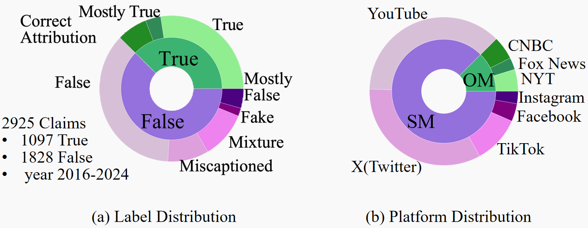

# Pioneering Explainable Video Fact-Checking with a New Dataset and Multi-role Multimodal Model Approach

Official repository for "[Pioneering Explainable Video Fact-Checking with a New Dataset and Multi-role Multimodal Model Approach](https://openreview.net/forum?id=fln4pLoJxK)" (Published in Artificial Intelligence for Social Impact Track, AAAI 2025).

## Authors

- Kaipeng Niu<sup>1†</sup> (kaipengniu@whu.edu.cn)
- Danni Xu<sup>2†</sup> (dannixu@u.nus.edu)
- Bingjian Yang<sup>1</sup> (yangbingjian@whu.edu.cn)
- Wenxuan Liu<sup>3</sup> (liuwx66@pku.edu.cn)
- Zheng Wang<sup>1*</sup> (wangzwhu@whu.edu.cn)

<sup>1</sup> National Engineering Research Center for Multimedia Software, School of Computer Science, Wuhan University, China  
<sup>2</sup> National University of Singapore, Singapore  
<sup>3</sup> Peking University, China  
<sup>†</sup> Equal contribution  
<sup>*</sup> Corresponding author


## Overview

We present TRUE (Truthfulness and Rationale with Underlying Evidence), a comprehensive video fact-checking dataset that includes detailed annotations for veracity labels, rationales, and supporting evidence. Along with the dataset, we also introduce 3MFact, a multi-role collaboration framework for video fact-checking.


## Project Poster


## Dataset Highlights

### Dataset Statistics


The TRUE dataset contains:
- **Total Samples**: 2,925 video fact-checking cases (2016-2024)
- **Video Length**: All videos are under 5 minutes
- **Veracity Labels**:
  - True Labels (1,097 samples):
    - Including True, Mostly True , and Correct Attribution
  - False Labels (1,828 samples):
    - Including False, Miscaptioned, Mixture, Fake, and Mostly False
- **Multi-platform Coverage**:
   - Social Media (SM): YouTube, X (Twitter), TikTok, Facebook, Instagram
   - Official Media (OM): New York Times (NYT), CNBC, Fox News

### Key Features
1. **Dual Rationales System**:
   - **Expert-Crafted Rationales (ECR)**: 
     - Direct extraction from professional fact-checking articles (Snopes)
     - Preserves original fact-checking reasoning and expert insights
     - Contains main rationales for direct rating justification
     - Includes additional supporting rationales for comprehensive verification
   - **LLM-Summary Rationales (LSR)**:
     - Systematically synthesized explanations through LLMs
     - Transforms fact-checking articles into concise yet comprehensive summaries
     - Decomposes the verification process into structured reasoning chains


2. **Comprehensive Annotations**:
   - Detailed Evidence Collection
   - Evidence-Rationale Relationship Analysis
   - Video Information (transcripts, metadata)


## Getting Started

### TRUE Dataset
- Download the TRUE dataset from [Baidu Netdisk]( https://pan.baidu.com/s/1yNA4dg5H1sxm5-XqUr-SQw?pwd=r8ws) | [OneDrive](https://whueducn-my.sharepoint.com/:u:/g/personal/kaipengniu_whu_edu_cn/EcMBGGGA7VVHsTwLui4gJMYBZDH-p3A8GJiXHamIiVTkoA?e=GPhcfv)
- For detailed documentation of the dataset structure, components, and statistics, please refer to [`TRUE_Dataset/TRUE_Dataset.md`](./TRUE_Dataset/TRUE_Dataset.md)

### 3MFact Code
- For setup, training, and evaluation instructions, please refer to [`3MFact_Code/Code_USAGE.md`](./3MFact_Code/Code_USAGE.md)
- The implementation code and usage instructions are in `3MFact_Code/`


## **Citation (To be updated)**
If you use this dataset or code in your research, please temporarily cite our paper as follows (the official citation format will be updated upon publication):


```bibtex
@inproceedings{niu2024pioneering,
  title={Pioneering Explainable Video Fact-Checking with a New Dataset and Multi-role Multimodal Model Approach},
  author={Niu, Kaipeng and Xu, Danni and Yang, Bingjian and Liu, Wenxuan and Wang, Zheng},
  booktitle={AAAI},
  year={2024}
}
```


## Contact

For any questions about the dataset or code, please contact:
- Kaipeng Niu (kaipengniu@whu.edu.cn)


## License

Our dataset is licensed under the [CC BY 4.0](https://creativecommons.org/licenses/by/4.0/). The associated codes are licensed under [Apache License 2.0](https://www.apache.org/licenses/LICENSE-2.0).
