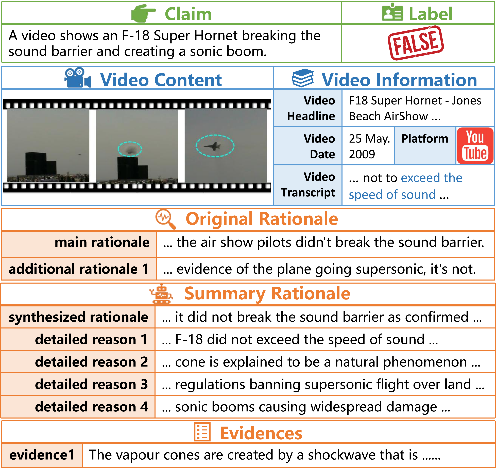

# TRUE Dataset

TRUE (Truthfulness and Rationale with Underlying Evidence) is a comprehensive video fact-checking dataset that includes detailed annotations for veracity labels, rationales, and supporting evidence. This dataset is designed to enhance models' ability to accurately identify and explain video content.


## Overview

The TRUE dataset is the first video fact-checking dataset designed to address general video-related claims with emphasis on explainable analysis supported by robust evidence. It contains:

- 2,925 samples spanning from 2016 to 2024
- 1,097 true videos and 1,828 false videos
- Videos under 5 minutes in length
- Content from diverse social media and official media platforms


## Download

Download the TRUE dataset from [Baidu Netdisk]( https://pan.baidu.com/s/1yNA4dg5H1sxm5-XqUr-SQw?pwd=r8ws)


## Detailed Dataset Description

### Core Components (As Described in Paper)




Each entry in the TRUE dataset contains five core components that have been thoroughly described in our paper:

1. **Basic Information**:
   - `url`: Source URL of the fact-check article from Snopes
   - `claim`: The statement being fact-checked
   - `rating`: Veracity label of the claim (e.g., "True", "False", "Mixture", etc.)
   - `content`: Full text content from the fact-checking article

2. **Video Information** (`video_information`):
   - `video_id`: Unique identifier for the video
   - `video_date`: Publication date of the video
   - `platform`: Source platform (e.g., "youtube")
   - `video_headline`: Original title of the video
   - `video_transcript`: Complete transcript generated using Deepgram API
   - `video_description`: Additional description if available
   - `video_length`: Duration of the video
   - `video_url`: Direct link to the video source

3. **Expert-Crafted Rationale / ECR / original_rationales**:
   - `main_rationale`: The primary rationale extracted directly from Snopes articles
   - `additional_rationales`: Multiple supporting pieces of evidence
     - Contains multiple rationales (`additional_rationale1`, `additional_rationale2`, etc.)
     - Each rationale preserves original reasoning and context from fact-checking articles

4. **LLM-Summary Rationale / LSR / summary_rationales**:
   - `synthesized_rationale`: A comprehensive summary of the fact-checking analysis
   - `detailed_reasons`: Structured breakdown of verification reasoning
     - Contains multiple detailed reasons (`reason1`, `reason2`, `reason3`, etc.)
     - Each reason provides specific aspects of the analysis

5. **Evidence Collection** (`evidences`):
   - `num_of_evidence`: Total number of evidence pieces
   - Numbered evidence entries (`evidence1`, `evidence2`, etc.)
   - Each evidence contains:
     - The evidence text
     - Associated references or links [if any]

### Additional Dataset Components (Extended Features)

In addition to the core components described in the paper, the TRUE dataset includes two additional components that provide enhanced analytical capabilities:

6. **Evidence-Rationale Relationship Analysis** (`relationship_with_evidence`):
   - Analyzes relationships between each evidence and claims/rationales through two rounds:
     - First round: Analyzes relationships with claim and original rationales (ECR)
     - Second round: Analyzes relationships with claim and detailed_reasons from summary rationales (LSR)
   - Each relationship entry contains:
     - Key in format `<rationale_key,evidence{i}>` (e.g., `<claim,evidence1>`, `<reason1,evidence2>`)
     - Detailed explanation of how the evidence supports or relates to the specific rationale/claim
     - Classification of evidence relevance ("Relevant" or "Irrelevant")
   - Special case: In each round, `<all_rationales,evidence{i}>` indicates the evidence is irrelevant to both the claim and all rationales in that round

7. **Additional Information** (`other`):
   - `iframe_video_links`: Collection of embedded video links from the fact-checking article

Each component is carefully structured to provide comprehensive context for fact-checking, enabling both human understanding and computational analysis. The dual rationale system (ECR and LSR) offers complementary perspectives on the fact-checking process, while the detailed evidence collection and analysis provide robust support for verification decisions.


## Directory Structure

The TRUE dataset is organized with the following directory structure:

```
TRUE-Dataset/
├── test_set.txt           # List of claim IDs in the test set (e.g., 10156802)
├── train_val_set.txt      # List of claim IDs in the training and validation sets (e.g., 10023005)
├── test/                  # JSON annotation files for test set claims
│   ├── 10156802.json
│   ├── 10490400.json
│   ├── 10608800.json
│   └── ...
├── train_val/            # JSON annotation files for training and validation set claims
│   ├── 10023005.json
│   ├── 10085809.json
│   ├── 10145403.json
│   └── ...
├── test_video/           # Video files corresponding to test set claims
│   ├── 10156802.mp4
│   ├── 10490400.mp4
│   ├── 10608800.mp4
│   └── ...
└── train_val_video/      # Video files corresponding to training and validation set claims
    ├── 10023005.mp4
    ├── 10085809.mp4
    ├── 10145403.mp4
    └── ...
```

### File Descriptions

1. **Dataset Split Files**
   - `test_set.txt`: Contains the list of claim IDs for the test set
     - Each line contains an 8-digit claim ID (e.g., 10156802, 10490400, 10608800)
   - `train_val_set.txt`: Contains the list of claim IDs for the training and validation sets
     - Each line contains an 8-digit claim ID (e.g., 10023005, 10085809, 10145403)
2. **Annotation Files**
   - Located in `test/` and `train_val/` directories
   - Each JSON file is named with its corresponding claim ID followed by `.json` extension
   - File naming format: `[claim_id].json` (e.g., `10156802.json`)
   - Contains all the detailed annotations 
   - The claim IDs in the JSON filenames match exactly with the IDs listed in the corresponding split file (test_set.txt or train_val_set.txt)
3. **Video Files**
   - Located in `test_video/` and `train_val_video/` directories
   - Each video file is named with its corresponding claim ID followed by `.mp4` extension
   - File naming format: `[claim_id].mp4` (e.g., `10156802.mp4`)
   - The claim IDs in the video filenames match exactly with the IDs listed in the corresponding split file and JSON annotation file


## Dataset Structure

### Important Notice About Data Statistics

In our verification process for the FALSE category (1,828 samples in total), we identified 15 samples that were previously uncategorized in their specific subcategories. These samples were part of our dataset but had not been statistically allocated to specific FALSE subcategories. We have now updated the classification:

**Initial Statistics in Paper:**
The subcategory breakdown originally showed:

- False: 1,062 samples
- Miscaptioned: 268 samples
- Mixture: 305 samples
- Fake: 52 samples
- Mostly False (MF): 126 samples
  Total: 1,813 samples (revealing a 15-sample discrepancy from the reported 1,828)

**Updated Statistics Status:**
The dataset now contains:

- False: 1,071 samples (+9)
- Miscaptioned: 270 samples (+2)
- Mixture: 307 samples (+2)
- Fake: 53 samples (+1)
- Mostly False (MF): 127 samples (+1)
  Total: 1,828 samples

The final distribution maintains the dataset's original proportions with complete subcategory classification for all samples.

### Labels

#### True Labels (Total: 1,097)

- True (798)
- Mostly True (MT, 100)
- Correct Attribution (CA, 199)

#### False Labels (Total: 1,828)

- False (1,071) [Updated from 1,062]
- Miscaptioned (270) [Updated from 268]
- Mixture (307) [Updated from 305]
- Fake (53) [Updated from 52]
- Mostly False (MF, 127) [Updated from 126]

### Source Platforms

#### Social Media (SM)

- Instagram (IG)
- TikTok (TT)
- Facebook (FB)
- X (formerly Twitter)
- YouTube (YT)

#### Official Media (OM)

- New York Times (NYT)
- CNBC
- Fox News (FN)


We appreciate your understanding regarding this correction and remain committed to maintaining the highest standards of data quality and transparency in our research.


## License

Our dataset is licensed under the [CC BY 4.0](https://creativecommons.org/licenses/by/4.0/). 

## Contact

For any questions about the dataset, please contact:

- Kaipeng Niu (kaipengniu@whu.edu.cn)